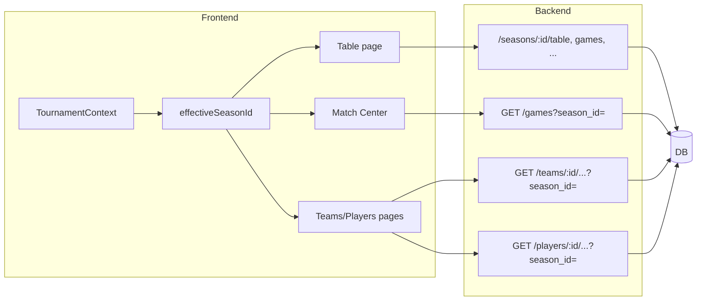

# Проверка бэкенда под header-фильтр (мульти-турнир)

## Итог проверки

Бэкенд уже отдаёт данные по `season_id`: эндпоинты под префиксом `/seasons/{season_id}/...` везде используют переданный в пути сезон. Риски — только там, где есть **опциональный** `season_id` с дефолтом `settings.current_season_id` (61), и в **синке/задачах**, которые по умолчанию крутят один сезон.

---

## 1. Что уже в порядке

**Эндпоинты в [backend/app/api/seasons.py**](backend/app/api/seasons.py) — `season_id` только из path, без подстановки дефолта:

- `GET /seasons/{season_id}/table` — таблица по сезону
- `GET /seasons/{season_id}/results-grid` — сетка результатов
- `GET /seasons/{season_id}/games` — матчи сезона
- `GET /seasons/{season_id}/player-stats` — игроки
- `GET /seasons/{season_id}/team-stats` — команды
- `GET /seasons/{season_id}/statistics` — сводная статистика

Фронт передаёт `effectiveSeasonId` в путь (`/seasons/63/table` и т.д.) — для этих маршрутов бэкенд корректен для мульти-турнира.

---

## 2. Где используется дефолт `current_season_id` (61)

В [backend/app/config.py](backend/app/config.py): `current_season_id: int = 61`. Он подставляется **только если** вызывающий не передал `season_id`.

| Файл                                     | Эндпоинт/метод                                                                    | Поведение                                                                                                                                                                   |
| ---------------------------------------- | --------------------------------------------------------------------------------- | --------------------------------------------------------------------------------------------------------------------------------------------------------------------------- |
| [games.py](backend/app/api/games.py)     | `GET /games` (список с фильтрами)                                                 | `season_id` в query опционален; при отсутствии = 61. Match Center на фронте передаёт `filters.season_id` (= effectiveSeasonId), так что при корректном фронте здесь всё ок. |
| [teams.py](backend/app/api/teams.py)     | `GET /teams/{id}/players`, `/games`, `/stats`, `/coaches`, `/vs/.../head-to-head` | У всех опциональный `season_id`; при отсутствии = 61. Нужно, чтобы страницы команд и H2H передавали с фронта `effectiveSeasonId`.                                           |
| [players.py](backend/app/api/players.py) | `GET /players/{id}/stats`, `/games`, `/teammates`                                 | Аналогично: опциональный `season_id`, дефолт 61. Фронт должен передавать сезон с учётом выбранного турнира.                                                                 |

Итого: логика бэкенда мульти-турнир поддерживает; важно, чтобы **все** турнир-зависимые вызовы с фронта передавали `season_id` (effectiveSeasonId). Если где-то забыли — пользователь будет видеть данные только по сезону 61.

---

## 3. Синк и фоновые задачи

- **Sync API** ([backend/app/api/sync.py](backend/app/api/sync.py)): у каждого метода есть `season_id` в query; если не передан — подставляется 61. Для заполнения данных по 62, 63, 65, 66 нужно явно вызывать синк с нужным `season_id` (например, `POST /sync/full?season_id=63`).
- **Celery** ([backend/app/tasks/sync_tasks.py](backend/app/tasks/sync_tasks.py)): задачи завязаны на `settings.current_season_id` (только 61). Другие сезоны по расписанию не синнятся.

Отдельно нужно решить: либо в конфиг добавить список сезонов для синка и гонять синк по каждому, либо оставить ручной/скриптовый запуск по каждому `season_id`.

---

## 4. Данные в БД

Чтобы при выборе Кубка (63), Первой лиги (62) и т.д. что-то показывалось:

- В таблице **seasons** должны быть записи с id 61, 62, 63, 65, 66 (или какие реально используются).
- По каждому такому сезону должны быть заполнены: games, score_table (для лиг), при необходимости player_season_stats, team_season_stats.

Если данные только по 61 — для остальных турниров фронт будет получать пустые таблицы/матчи; это не баг бэкенда, а вопрос наполнения и синка.

---

## 5. Задачи для разработчиков

**Фронт (проверить/дописать):**

1. **Match Center** — убедиться, что при запросе матчей всегда передаётся `season_id: effectiveSeasonId` (уже сделано в контексте header-фильтра; при добавлении новых экранов — не забывать).
2. **Страницы команд** (состав, матчи, статистика, тренеры, H2H) — везде, где запросы зависят от сезона, передавать в API `season_id` из контекста турнира (effectiveSeasonId), а не опускать параметр.
3. **Страницы игроков** (статистика, матчи, партнёры по команде) — то же: при турнир-зависимых блоках передавать effectiveSeasonId.

**Бэкенд (документация и контракт):**

1. В [docs/API_FRONTEND.md](backend/docs/API_FRONTEND.md) явно указать: для мульти-турнира фронт должен всегда передавать `season_id` в запросах к `/games`, `/teams/*`, `/players/*` (где параметр есть). При отсутствии параметра бэкенд использует «текущий» сезон (61).
2. Опционально: в описании `GET /games` и остальных таких эндпоинтов добавить пример с `season_id` (например, 63 для кубка).

**Бэкенд (данные и синк):**

1. Убедиться, что в БД есть сезоны с id, соответствующими турнирам из конфига фронта (61, 62, 63, 65, 66), и при необходимости добавить миграцию/сид для записей в `seasons`.
2. Реализовать наполнение данными по всем нужным сезонам: либо скрипт/документация с вызовами `POST /api/v1/sync/full?season_id=X` для каждого X, либо расширить синк-сервис/таски, чтобы они принимали список season_id (из конфига или .env) и синкали по очереди.
3. Celery: либо добавить в конфиг список сезонов и в задаче по расписанию вызывать full_sync по каждому, либо зафиксировать в документации, что по умолчанию синнится только current_season_id, а остальные — вручную/скриптом.

**Тесты (по желанию):**

1. Добавить интеграционный тест: для двух разных season_id (например, 61 и 63), по которым в тестовой БД есть данные, запросы `GET /seasons/{id}/table` и `GET /seasons/{id}/games` возвращают разные данные (разные season_id в ответах или разный состав записей).

---

## 6. Краткая схема потоков

Если фронт везде передаёт `season_id` (effectiveSeasonId), бэкенд уже возвращает данные по выбранному турниру. Задачи выше закрывают оставшиеся риски и обеспечивают наличие данных по всем сезонам.